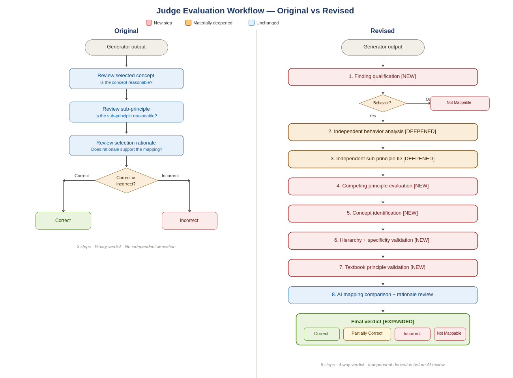

# Concept Mapping Evaluation Framework

## Overview

The Concept Mapping Evaluation Framework evaluates whether an AI-generated concept mapping accurately represents the instructional behavior demonstrated by a chess finding.

Early evaluation relied primarily on assessing whether a concept appeared reasonable. During experimentation, several limitations emerged:

* Behavior was not evaluated independently before concept assessment.
* Multiple plausible mappings produced inconsistent outcomes.
* Concept hierarchy and specificity were not evaluated systematically.
* Concepts could appear reasonable while still being too broad, too narrow, or insufficiently grounded in chess instruction.

The framework was refined through iterative evaluation and failure analysis to improve consistency, traceability, and instructional accuracy.

*Evolution of the evaluation framework from an intuitive concept-review process to a structured behavior-first evaluation workflow.*

---

## Why the Framework Changed

Several mappings that were initially classified as incorrect were later determined to be valid after deeper analysis.

This revealed that evaluation quality depended not only on the concept mapping itself, but also on the structure of the evaluation process.

Common judge failure modes included:

* Evaluating concepts and sub-principles before identifying the primary instructional behavior represented by the finding.
* Accepting mappings that explained only part of the finding rather than the full behavior being measured.
* Inconsistent handling of cases where multiple plausible mappings appeared valid.
* Missing validation of concept hierarchy and specificity.
* Accepting concepts that were not grounded in recognized chess learning material.

These observations demonstrated that concept-mapping quality could not be measured reliably without first improving the evaluation framework itself.

---

## Key Design Decisions

### Behavior Before Concept Evaluation

The evaluator must first identify the primary instructional behavior represented by the finding before reviewing the AI-generated concept or sub-principle.

This prevents the proposed mapping from influencing interpretation of the finding itself.

### Independent Sub-Principle Identification

The evaluator independently determines the smallest instructional principle demonstrated by the finding before assessing the AI-generated mapping.

This creates an objective anchor for evaluation.

### Structured Comparison of Competing Mappings

When multiple mappings appear plausible, the evaluator explicitly compares them rather than relying on intuition.

Preference is given to the mapping that explains the largest proportion of the observed behavior.

### Concept Hierarchy Validation

The selected concept must represent the closest broader instructional theme above the selected sub-principle.

This prevents acceptance of concepts that are too broad or too narrow.

### Specificity Validation

When a piece-specific concept exists, the evaluator must determine whether it provides a more precise explanation than a generic principle.

This reduces hierarchy-selection errors and improves instructional accuracy.

### Textbook Principle Validation

Concepts and sub-principles must be grounded in recognized chess learning material.

Constructed labels, invented concepts, and unsupported instructional categories are rejected.

---

## Outcome

The final framework transformed evaluation from a subjective concept review into a structured instructional reasoning process.

By introducing behavior-first evaluation, hierarchy validation, specificity checks, and textbook validation, the framework produced more consistent judgments and improved confidence in the concept-mapping benchmark.
