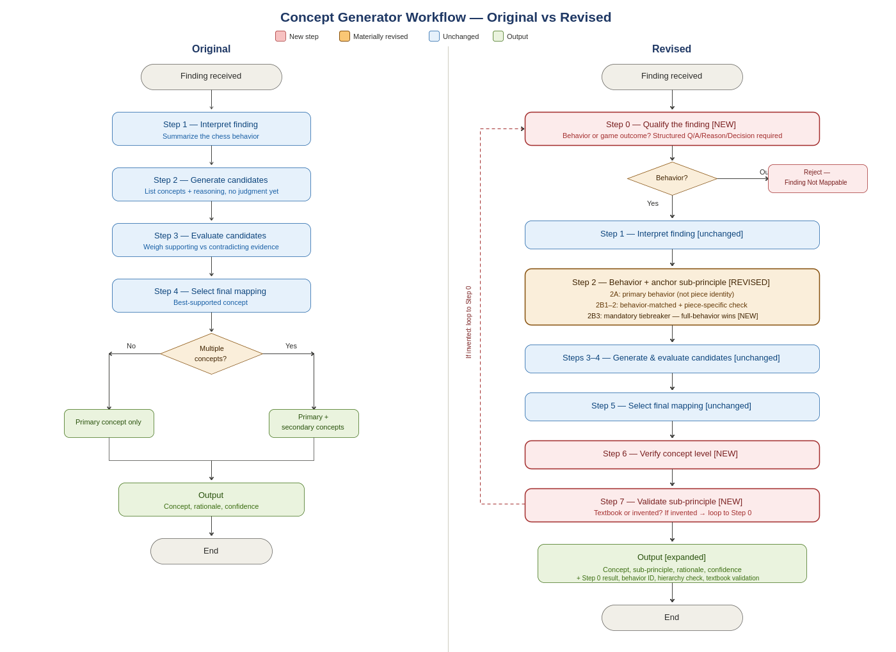
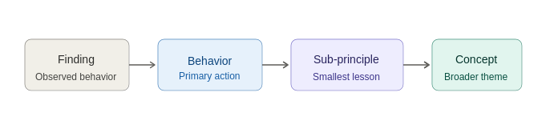

# Concept Mapping Framework

## Overview

The Concept Mapping Framework translates chess findings into instructional chess concepts that can later be used to generate parent-facing insights.

A finding describes an observable chess behavior:

> Queen moved three times in the opening.

A concept describes the underlying instructional theme:

> Rapid Piece Development

Early experimentation revealed that concept mapping is not a simple classification task. Multiple plausible concepts often exist for the same finding, concepts operate at different levels of abstraction, and some findings describe outcomes rather than instructional behaviors.

The framework was iteratively refined through evaluation and failure analysis.

*Evolution of the concept-mapping workflow from the original concept-selection approach (left) to the final behavior-first framework with hierarchy and textbook validation (right).*

---

## Why the Framework Changed

The original workflow focused on interpreting findings, generating candidate concepts, and selecting the best mapping.

Evaluation exposed several recurring failure modes:

* Concept hierarchy selection errors
* Outcome-oriented findings entering the mapping workflow
* Generic concepts selected when more specific concepts existed
* Concept hallucination
* Prompt execution failures

These observations revealed that concept mapping required a structured decision process rather than direct concept generation.

---

## Key Design Decisions

### Behavior Before Concept

Reliable concept selection depends on first identifying the instructional behavior represented by the finding.

### Sub-Principle Before Concept

An explicit hierarchy was introduced between findings and concepts to improve traceability, concept selection, and instructional consistency.

*Concept hierarchy used during concept mapping. Findings are first translated into behaviors, then mapped to the smallest instructional principle before selecting the broader concept.*

### Selection Over Generation

Concept mapping is fundamentally a selection problem rather than a generation problem. Multiple plausible concepts often exist and must be evaluated against one another.

### Explicit Hierarchy Validation

The selected concept must represent the closest broader instructional theme above the chosen sub-principle.

### Textbook Validation

Concepts and sub-principles must be grounded in recognized chess learning material rather than invented labels.

---

## Major Improvements

Compared with the original workflow, the revised framework introduced:

* Finding qualification gates
* Behavior-first reasoning
* Anchor sub-principles
* Concept hierarchy validation
* Textbook principle validation
* Structured tie-breaker rules
* Auditable reasoning steps

These additions transformed concept mapping from a concept-labeling exercise into a structured instructional reasoning process capable of supporting consistent concept mapping, evaluation, and future parent-facing insight generation.
